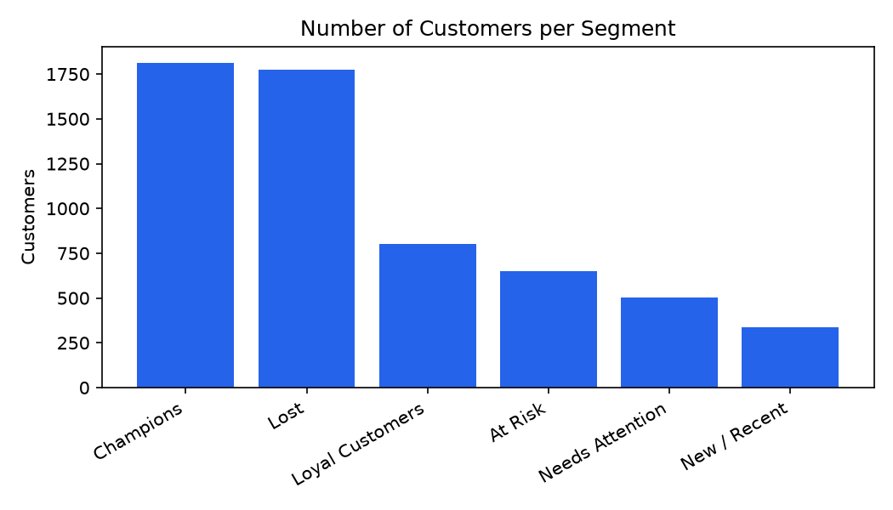
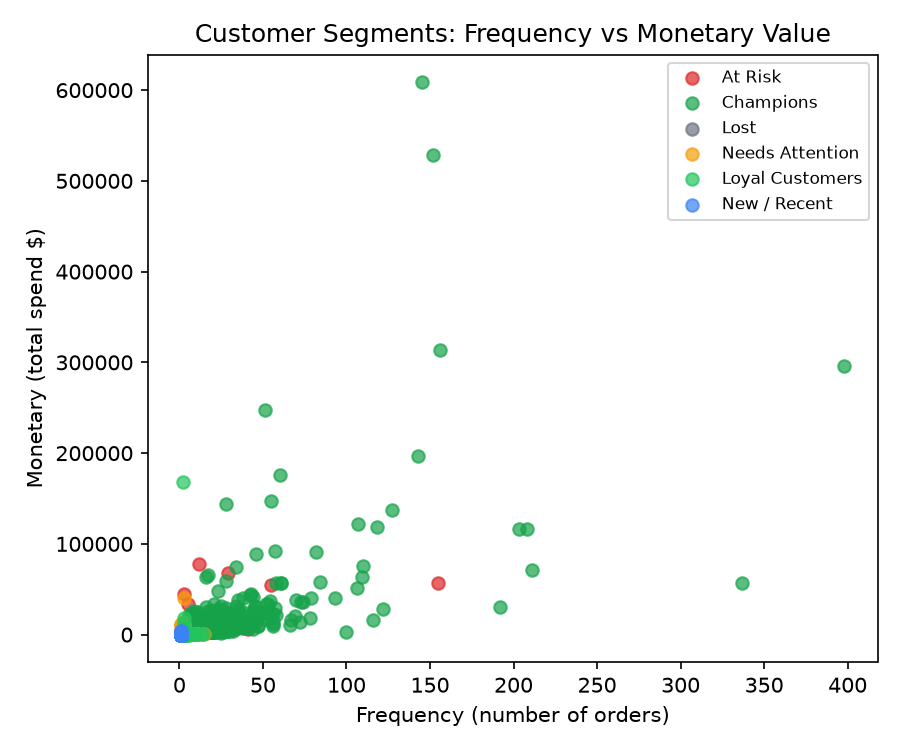

# Customer Segmentation Using RFM Analysis

A customer segmentation project using **RFM (Recency, Frequency, Monetary)** analysis to identify customer lifetime value, loyalty, and churn risk. Built with **Python**, **Pandas**, **Excel**, and Power BI using the *Online Retail II* dataset.

---

## Business Question
Which customers are most valuable, which are at risk of churning, and where should a customer retention budget be focused?

---

## Tools & Technologies
* Python (Pandas, Matplotlib)
* Microsoft Excel
* Microsoft Power BI
* Git & GitHub

---

## Dataset
* **Source:** Online Retail II Dataset (~1,067,371 raw transaction records)
* **Attributes:** Invoice Number, StockCode, Description, Quantity, Invoice Date, Unit Price, Customer ID, Country
* **Data Cleaning:**
  * Removed transactions without `Customer ID`
  * Filtered cancelled orders / negative quantities
  * Converted timestamps to datetime format
  * Calculated transaction line total (`Quantity` × `Price`)
  * **Final Clean Dataset:** 805,620 transactions across 5,881 unique customers

---

## RFM Methodology
* **Recency (R):** Days since the customer's last purchase (lower = more recent).
* **Frequency (F):** Number of distinct orders placed (higher = more frequent).
* **Monetary (M):** Total spend across all purchases (higher = greater spend).

Each customer was scored from 1 to 4 across quartiles for R, F, and M to assign distinct behavioral segments.

---

## Customer Segments & Results

| Segment | Customers | % of Customers | Revenue | % of Revenue |
| :--- | :---: | :---: | :---: | :---: |
| **Champions** | 1,814 | 30.8% | $13,463,546.60 | 75.9% |
| **At Risk** | 650 | 11.1% | $2,128,358.10 | 12.0% |
| **Loyal Customers** | 803 | 13.7% | $791,828.90 | 4.5% |
| **Needs Attention** | 501 | 8.5% | $652,863.20 | 3.7% |
| **Lost** | 1,776 | 30.2% | $575,787.10 | 3.2% |
| **New / Recent** | 337 | 5.7% | $131,045.20 | 0.7% |

---

## Key Business Insights
* **Revenue Concentration:** **Champions** make up ~31% of the customer base but drive **75.9%** of total revenue.
* **High Churn Risk:** The **At Risk** group accounts for **12% of total revenue** ($2.1M). Targeted re-engagement and win-back offers should be prioritized here.
* **Low Impact Churn:** **Lost** customers represent 30.2% of the base but only 3.2% of historical spend, meaning retention budgets are better directed toward Champions and At-Risk segments.

---

## Visualizations

### Customer Distribution by Segment


### Frequency vs. Monetary Value


---

## Power BI Dashboard
The included interactive dashboard (`Customer_Segmentation_RFM.pbix`) provides:
* KPI cards: Total revenue, active customers, average recency.
* Breakdown by segment with cross-filtering on RFM scores.
* Visual customer distribution across purchasing frequency and spend.

---

## Project Structure
```text
├── analysis.py                         # Data cleaning & RFM calculation script
├── Customer_Segmentation_RFM.pbix      # Interactive Power BI dashboard
├── RFM_Customer_Segmentation.xlsx.csv  # Processed customer segment export
├── online_retail_II.csv                # Raw retail dataset
├── chart_segment_counts.png            # Customer segment visualization
├── chart_frequency_vs_monetary.png     # Frequency vs. Spend scatter plot
└── README.md                           # Documentation
